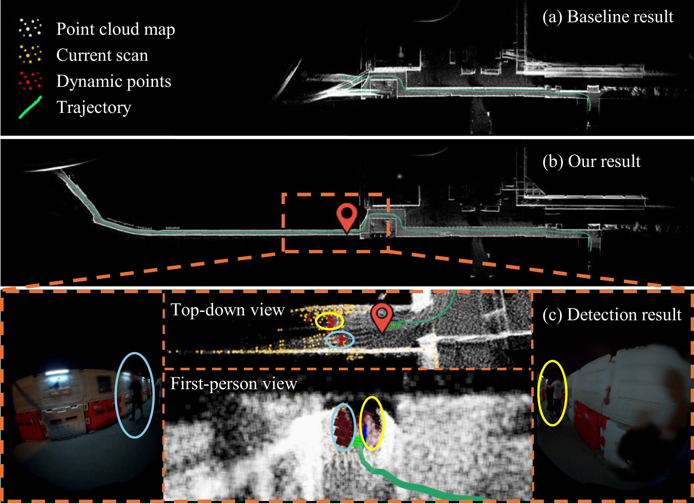
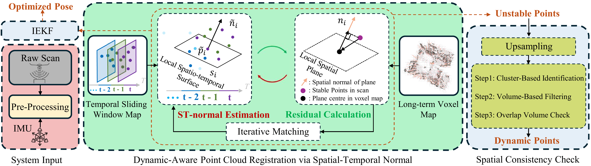
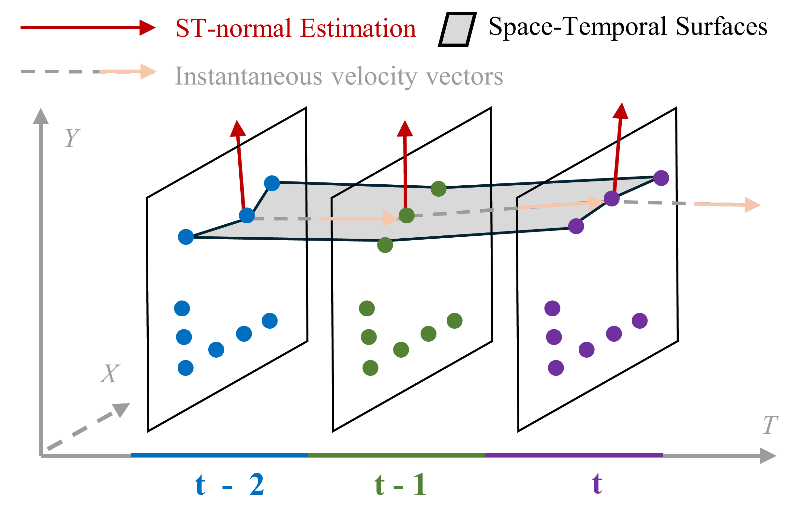

# Breaking the Static Assumption: A Dynamic-Aware LIO Framework

<div align="center">

**[Paper (arXiv)](https://arxiv.org/abs/2510.22313v1) | [Paper (IEEE Xplore)](https://ieeexplore.ieee.org/abstract/document/11207655/) | [Video](doc/Multimedia.mp4) | [Dataset](https://drive.google.com/drive/folders/1-HeXGPzK4I_z7q5YBMP0S9vPI0XF5hT3?usp=sharing)**

[](LICENSE)
[](http://wiki.ros.org/noetic)
[](https://ubuntu.com/)

</div>

This repository contains the official implementation of the **IEEE RA-L** paper:

**"Breaking the Static Assumption: A Dynamic-Aware LIO Framework Via Spatio-Temporal Normal Analysis"**

---

## :bookmark_tabs: Table of Contents
- [Overview](#overview)
- [Key Features](#key-features)
- [Demo Video](#demo-video)
- [System Architecture](#system-architecture)
- [Results](#results)
- [Installation](#installation)
- [Usage](#usage)
- [Dataset](#dataset)
- [Citation](#citation)
- [Acknowledgements](#acknowledgements)

---

## :books: Overview

Most LiDAR-Inertial Odometry (LIO) systems assume a **static world**, but this rarely holds in practice. Moving objects like pedestrians and vehicles cause registration algorithms to mistake dynamic elements for fixed landmarks, leading to severe localization failures—especially when:

- Dynamic objects dominate the scene
- Static features are sparse  
- Geometric degeneracy exists (e.g., tunnels, corridors)

<div align="center">
  
  <p><i>Figure 1: Our method maintains accurate localization in highly dynamic environments where traditional LIO fails.</i></p>
</div>

### The Challenge

Existing methods face a **circular dependency**: accurate localization needs reliable static point identification, yet detecting dynamic objects requires precise pose estimates. Previous approaches separate these tasks—filtering dynamic points before registration—which fails when initial poses are unreliable.

### Our Solution

We **integrate spatio-temporal normal analysis directly into registration**, breaking the circular dependency by:

- **Jointly solving** state estimation and dynamic detection in a unified framework
- **Modeling point motion** through 4D space-time surface analysis  
- **Filtering dynamic points iteratively** during pose optimization, not as pre-processing
- **Achieving real-time performance** (~50ms per scan) with efficient spatial consistency checks


---

## :movie_camera: Demo Video

Our supplementary video demonstrates the system performance across various dynamic scenarios:

<div align="center">
  
[](doc/Multimedia.mp4)

**[📥 Download Video (doc/Multimedia.mp4)](doc/Multimedia.mp4)**

</div>

*The video showcases our method handling challenging dynamic environments including pedestrians, vehicles, and geometrically degraded scenes.*

---

## :gear: System Architecture

<div align="center">
  
  <p><i>Figure 2: Overview of our dynamic-aware LIO framework. The system consists of three main components: input preprocessing, dynamic-aware registration, and static map building.</i></p>
</div>

### Core Components

1. **Input Preprocessing**: IMU preintegration and motion distortion correction
2. **Dynamic-Aware Registration**: 
   - Compute spatio-temporal normals from temporal sliding window map (~2s)
   - Classify points as stable/unstable based on temporal component
3. **Static Map Building**:
   - DBSCAN clustering to identify dynamic object candidates
   - Spatial consistency check via volumetric overlap analysis
   - Filter false positives (newly observed areas vs. true dynamic objects)

### Spatio-Temporal Normal Analysis

<div align="center">
  
  <p><i>Figure 3: Points are analyzed in 4D space-time.</i></p>
</div>

**Key Concept:** We model point clouds in 4D space-time and compute normal vectors **ñ = (a, b, c, d)** for each point:
- **(a, b, c)**: Spatial components (traditional 3D normal)
- **d**: Temporal component (measures surface motion over time)

**Dynamic Detection:** Points with **|d| > 0.1** are classified as unstable and excluded from registration. This threshold corresponds to ~5.7° deviation in the temporal dimension, providing physically interpretable motion detection.

---

## :wrench: Installation

### Prerequisites

Our system has been tested on:
- **Ubuntu 22.04** (should also work on Ubuntu 20.04)
- **ROS Noetic**
- **PCL >= 1.8**
- **Eigen >= 3.3.4**

### 1. Install ROS Noetic (Ubuntu 22.04)

```bash
echo "deb [trusted=yes arch=amd64] http://deb.repo.autolabor.com.cn jammy main" | sudo tee /etc/apt/sources.list.d/autolabor.list
sudo apt update
sudo apt install ros-noetic-autolabor
```

For other Ubuntu versions, follow the [official ROS installation guide](http://wiki.ros.org/noetic/Installation).

### 2. Install Dependencies

```bash
# PCL
sudo apt install libpcl-dev

# Eigen
sudo apt install libeigen3-dev
```

Alternatively:
- **PCL**: Follow [PCL Installation Guide](http://www.pointclouds.org/downloads/linux.html)
- **Eigen**: Follow [Eigen Installation Guide](http://eigen.tuxfamily.org/index.php?title=Main_Page)

### 3. Install Livox ROS Driver

```bash
cd ~/catkin_ws/src
git clone https://github.com/Livox-SDK/livox_ros_driver.git
cd ..
catkin build livox_ros_driver
```

For detailed instructions, see [Livox ROS Driver](https://github.com/Livox-SDK/livox_ros_driver).

### 4. Build BTSA

```bash
cd ~/catkin_ws/src
git clone https://github.com/thisparticle/btsa.git
cd ..
catkin build btsa
source devel/setup.bash
```

---

## :rocket: Usage

### Quick Start

1. **Launch the system:**
```bash
roslaunch btsa dynamic.launch
```

2. **Play your rosbag:**
```bash
rosbag play <your_dataset>.bag
```

### Launch Files

We provide different launch configurations for various sensors and scenarios:

```bash
roslaunch btsa dynamic.launch      # For general dynamic environments
roslaunch btsa ecmd.launch         # For ECMD dataset
roslaunch btsa geode.launch        # For GEODE dataset  
roslaunch btsa UrbanNav.launch     # For UrbanNav dataset
```

### Configuration

Configuration files are located in the `config/` directory:
- `dynamic.yaml`: Default parameters for dynamic environments
- `ecmd.yaml`: Settings for ECMD dataset
- `geode.yaml`: Settings for GEODE dataset
- `urbannav.yaml`: Settings for UrbanNav dataset
---

## :floppy_disk: Dataset

### Download

We provide a comprehensive dataset for evaluation:

**[Google Drive Link](https://drive.google.com/drive/folders/1-HeXGPzK4I_z7q5YBMP0S9vPI0XF5hT3?usp=sharing)**

The dataset includes:
- ✅ Self-collected dynamic environment sequences
- ✅ Preprocessed public datasets (ECMD, UrbanNav, GEODE)
- ✅ Ground truth trajectories (RTK-GPS)
- ✅ Configuration files for each sequence

---

## :pencil: Citation

If you find our work useful in your research, please consider citing:

```bibtex
@ARTICLE{
}
```

**Paper Links:**
- [arXiv](https://arxiv.org/)
- [IEEE Xplore](https://ieeexplore.ieee.org/)

---

## :pray: Acknowledgements

We sincerely thank the authors of the following open-source projects:

- [**FAST-LIO**](https://github.com/hku-mars/FAST_LIO): For the efficient LIO framework and iKD-Tree implementation
- [**PV-LIO**](https://github.com/HViktorTsoi/PV-LIO): For insights on plane-based registration
- [**dynamic_object_detection**](https://github.com/UTS-RI/dynamic_object_detection): For dynamic object handling strategies
- [**MapMOS**](https://github.com/PRBonn/MapMOS): For static map building evaluation protocols

Special thanks to the authors of ECMD, UrbanNav, GEODE, and Helimos datasets for making their data publicly available.


---


---

<div align="center">

**Star ⭐ this repository if you find it helpful!**

</div>
