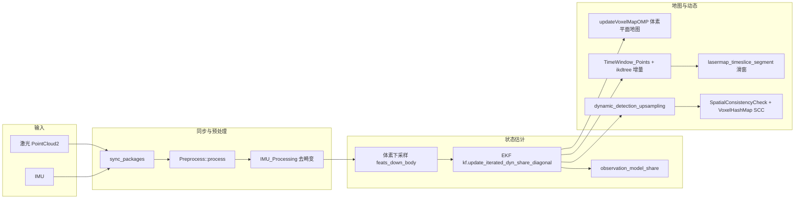
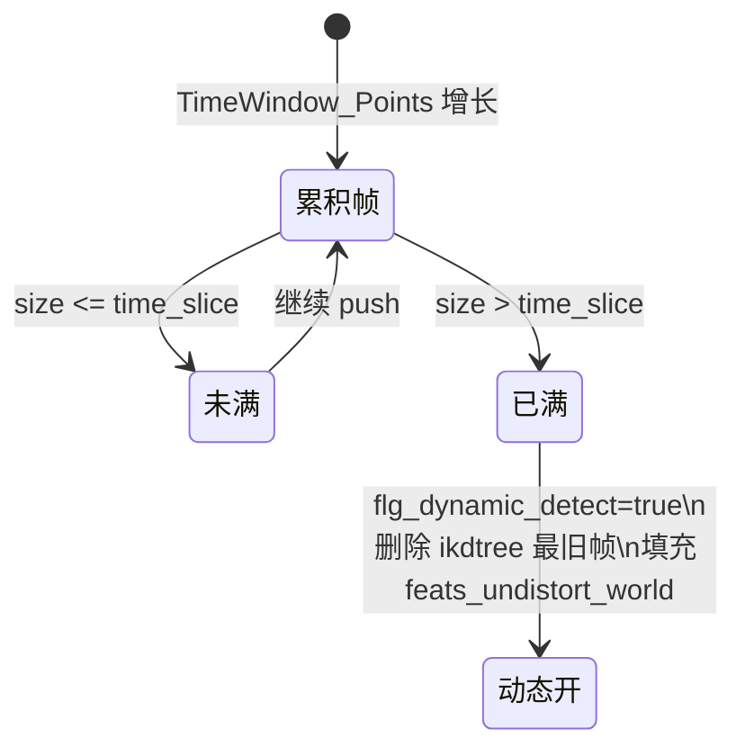
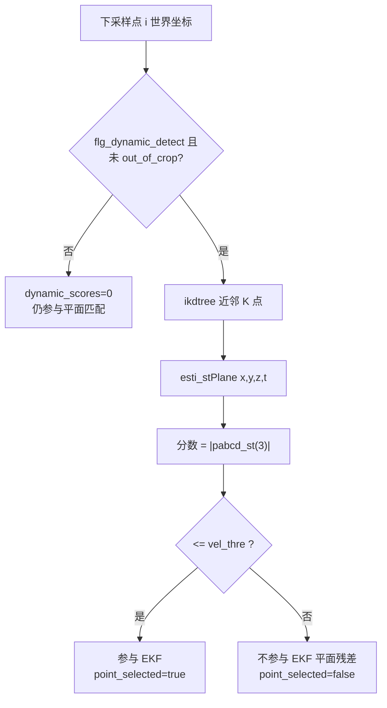
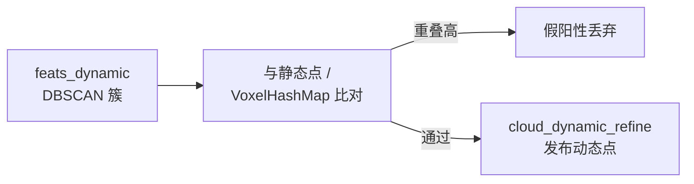

<p align="center">

  <h1 align="center"> Breaking the Static Assumption: A Dynamic-Aware LIO Framework (测试)
  </h1>

[comment]: <> (  <h2 align="center">PAPER</h2>)
  <h3 align="center">
  <a href="https://github.com/arclab-hku/btsa">Original Github</a> 
  </h3>


 ```bash
# 安装livox
cd ~/catkin_ws/src
git clone https://github.com/Livox-SDK/livox_ros_driver.git
cd ..
catkin build livox_ros_driver

# 安装btsa
cd ~/catkin_ws/src
git clone git@github.com:R-C-Group/btsa_test.git
cd ..
# catkin clean btsa
catkin build btsa
source devel/setup.bash

# 其他依赖安装
sudo apt-get install libgoogle-glog-dev
# 但系统自动安装的可能有问题，修复了“CMakeLists.txt”
``` 


* 运行：
```bash
source devel/setup.bash
roslaunch btsa dynamic.launch

# 速腾激光雷达
roslaunch btsa robosense.launch 
```


# 关于如何实现 dynamic slam

本节说明本仓库中 **动态感知 / 动态 SLAM** 相关数据流：在静态体素地图与 ikd-Tree 地图并存的前提下，如何 **给点打「动态分数」**、如何 **抑制动态物体对位姿估计的影响**，以及 **后处理聚类与时空一致性（SCC）** 的作用。实现主要集中在 `src/voxelMapping.cpp`，参数在 `config/*.yaml` 的 **`btsa`** 与 **`preprocess`** 小节。

---

## 1. 单帧主循环在做什么（鸟瞰）

每一帧同步好的雷达+IMU 经过预处理后，依次完成：**去畸变 → 体素下采样 → EKF 更新（内含动态打分）→ 体素地图 / ikd-Tree 增量 → 动态上采样 → 空间一致性检查 → 发布**。整体数据流可用下图概括：



---

## 2. 动态检测何时「开启」：时间滑窗与 `flg_dynamic_detect`

- 每一帧世界系扫描点 `world_lidar->points` 会 **`push_back` 到 `TimeWindow_Points`**，同时向 **`ikdtree`** 增加点，用于 **历史几何** 的近邻搜索。
- 当 **`TimeWindow_Points.size() > time_slice`**（`btsa/time_slice`，默认 20）时，在 **`lasermap_timeslice_segment()`** 中：
  - 置 **`flg_dynamic_detect = true`**，表示已进入「有足够历史帧」的阶段；
  - 从 **`ikdtree`** 中 **删除最旧一帧** 的点，控制地图时间厚度；
  - 把当前帧 **去畸变点云变到世界系** 写入 **`feats_undistort_world`**，供后续 **动态上采样** 在 **整帧稠密点** 上找邻域。



---

## 3. 核心：如何给点打「动态分数」`dynamic_scores`

动态打分发生在 **EKF 迭代更新** 调用的观测函数 **`observation_model_share()`** 中（与体素平面残差共用同一套接口）：

1. 对每个下采样点 \(i\)，在世界系下得到坐标 **`world_lidar->points[i]`**。
2. 若 **`flg_dynamic_detect`** 已打开，且该点 **不在裁剪盒外**（`out_of_crop_index(i)!=1`），则在 **`ikdtree`** 上做 **`Nearest_Search`**，取 **`match_points`**（参数 `btsa/match_points`）个近邻。
3. 用 **`esti_stPlane`** 在 **(x, y, z, t)** 四维上拟合局部平面（`include/common_lib.h`），得到系数 **`pabcd_st`**；其中 **`|pabcd_st(3)|`** 被当作 **「该点偏离局部静态流形」的程度**，写入 **`dynamic_scores(i)`**（拟合失败或近邻不足时分数为 0 且仍参与平面匹配）。
4. 与阈值 **`vel_thre`**（`btsa/vel_thre`，ROS 参数名在代码里为 `scan/vel_thre`）比较：
   - 若 **`|pabcd_st(3)| <= vel_thre`**：**`point_selected_surf_[i]=true`**，**`dynamic_scores(i)=|pabcd_st(3)|`**，参与当帧平面残差；
   - 若 **更大**：**`point_selected_surf_[i]=false`**，**`dynamic_scores(i)`** 仍为 **`|pabcd_st(3)|`**，但该点 **不参与** 当帧 **平面残差**（减少对车辆等运动物体的拉拽）。
5. **`detect_cnt`** 在 **`observation_model_share` 每被调用一次** 时自增（同一帧内 **EKF 迭代** 会多次调用）；当 **`detect_cnt > detect_cnt_thre`** 时置 **`stop_detect=true`**，**同一帧后续的迭代** 将 **跳过** 整段动态打分（降低计算）。**下一帧** 在 `kf.update_iterated_dyn_share_diagonal` 之前会再次 **`stop_detect=false; detect_cnt=0`**，因此会重新打分。



---

## 4. 动态「上采样」：`dynamic_detection_upsampling()`

仅靠下采样点判断容易 **漏检**。在 **`dynamic_scores(i) >= vel_thre`** 的 **`feats_down_world`** 查询点上，对 **`feats_undistort_world`**（整帧去畸变后的世界系稠密点云）建 **KdTree**，按 **K 近邻或半径**（`btsa/use_radius_search`、`neighborhood_size`、`neighbourhood_radius`）搜索；**返回的邻域下标是 `feats_undistort_world` 中的索引**，并入集合后把对应稠密点写入 **`feats_dynamic`**，其余稠密点归入 **`feats_static_world`**，供后续 DBSCAN 与 SCC 使用。

---

## 5. 空间一致性与 SCC：`SpatialConsistencyCheck()`

1. 对 **`feats_dynamic`** 做 **DBSCAN** 聚类，得到多个簇。
2. 对每个簇做 **形状/体积启发式过滤**（过长条形、过大体积等跳过）。
3. 用 **`feats_static_world`** 与 **`voxel_hash_map_`（VoxelHashMap）** 做 **静态体素相交检验**：若簇与静态结构 **重叠比例高**，则视为 **假阳性** 丢弃；否则簇内点写入 **`cloud_dynamic_refine`** 用于 **`/cloud_dynamic` 发布**。
4. **`voxel_hash_map_.RemovePointsFarFromTime`** 按时间剔除远处过时体素，避免地图无限增长。

另：**`/cloud_unstable`** 发布的是当帧 **`world_lidar`** 中 **`dynamic_scores(i) >= vel_thre`** 的下采样点（与 DBSCAN 精炼后的 **`/cloud_dynamic`** 不同，便于观察「打分判动」的原始集合）。



---

## 6. 关键参数一览（`config/dynamic.yaml` 或 `robosense.yaml` 中 `btsa` 段）

| 参数 | 作用 |
|------|------|
| **`time_slice`** | 滑窗长度；超过后才 **`flg_dynamic_detect=true`** 并维护 **`feats_undistort_world`**。 |
| **`vel_thre`** | 动态分数阈值；与 `esti_stPlane` 的 **`|pabcd_st(3)|`** 比较。 |
| **`match_points`** | ikdtree 近邻个数，影响平面拟合稳定性。 |
| **`detect_cnt_thre`** | 同一帧内 **`observation_model_share` 调用次数** 超过该值后 **`stop_detect`**（控制迭代内动态打分开销）。 |
| **`range_x/y/z`** | 裁剪盒；盒外点 **`out_of_crop_index=1`**，跳过动态打分。 |
| **`use_radius_search` / `neighborhood_size` / `neighbourhood_radius`** | 动态上采样邻域搜索方式。 |
| **`scc_voxel_size` / `scc_voxel_time`** | VoxelHashMap 体素尺寸与时间窗，用于 SCC。 |

---

## 7. 相关源码位置（便于对照阅读）

| 模块 | 文件与符号 |
|------|------------|
| 主循环、同步、发布 | `src/voxelMapping.cpp`：`main` 内 `while`、`sync_packages`、`standard_pcl_cbk` |
| 动态打分与 EKF 观测 | `observation_model_share` |
| 时间滑窗 | `lasermap_timeslice_segment` |
| 动态上采样 | `dynamic_detection_upsampling` |
| DBSCAN + SCC + 发布 | `SpatialConsistencyCheck`、`publish_dynamic_points` |
| 雷达预处理（含速腾） | `src/preprocess.cpp` / `src/preprocess.h` |
| 平面拟合与动态分数底层 | `include/common_lib.h`：`esti_stPlane` |

以上与代码中 **新增的中文注释**（`// ...` 块）一致，阅读源码时可与本文对照。